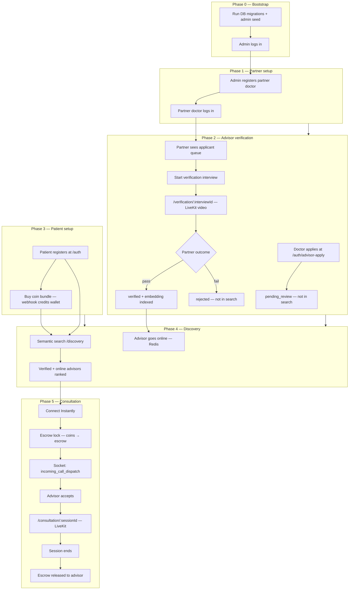
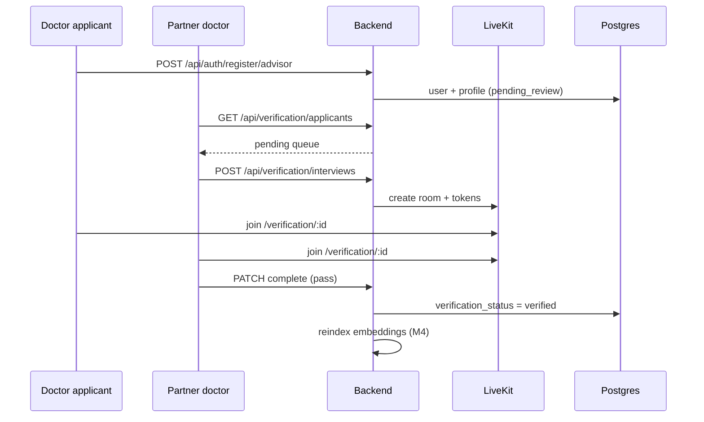
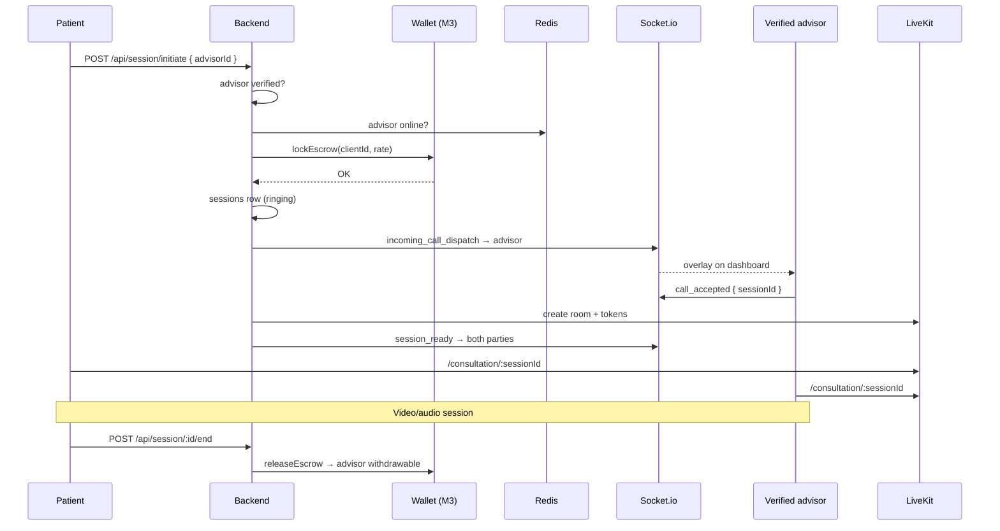

# End-to-End Workflow — Start to Finish

Single reference for how **Project Codex (GreenHeart)** works from platform bootstrap through a completed patient consultation. Use this for demos, onboarding, and implementation alignment.

**Related specs:** [vision-and-product.md](../vision-and-product.md) · [M6 verification](../modules/M6-advisor-verification.md) · [architecture.md](../architecture.md)

---

## At a glance

Four roles, one marketplace. Doctors are **verified before they are searchable**. Patients pay in **Coins** with **escrow** before each call.

| Phase | Who | Outcome |
|-------|-----|---------|
| **0 — Bootstrap** | Platform (seed) | First admin exists |
| **1 — Supply side setup** | Admin → Partner doctor | Partner can verify applicants |
| **2 — Advisor onboarding** | Doctor applicant → Partner doctor | Doctor becomes `verified` |
| **3 — Demand side setup** | Patient | Account + coin balance |
| **4 — Discovery** | Patient | Finds verified, online advisor |
| **5 — Consultation** | Patient ↔ Verified advisor | Escrow → call → release |

---

## Master flow (happy path)

---

## Phase 0 — Platform bootstrap

**Actor:** DevOps / first deploy  
**Goal:** Database ready, first admin can log in.

| Step | Action | System |
|------|--------|--------|
| 0.1 | Run SQL migrations `001` → `004` | Postgres schema |
| 0.2 | Run `backend/sql/seed/001_admin.sql` | Creates first `admin` user |
| 0.3 | Admin logs in at `/auth` | JWT cookie issued |

> Admin is **not** self-registerable. Every environment starts from seed.

---

## Phase 1 — Admin registers partner doctor

**Actors:** Admin, Partner doctor (senior doctor on your team)  
**Goal:** Partner doctor has credentials and access to verification dashboard.

| Step | Actor | UI / API | Result |
|------|-------|----------|--------|
| 1.1 | Admin | `/admin` → POST `/api/admin/partner-doctors` | Partner account created (`role: partner_doctor`) |
| 1.2 | Partner doctor | `/auth` login | JWT with partner role |
| 1.3 | Partner doctor | `/partner` dashboard | Empty applicant queue (until doctors apply) |

**Admin can also:** list partner doctors, override any advisor `verification_status` (`suspended`, etc.).

---

## Phase 2 — Doctor applies and gets verified

**Actors:** Doctor applicant, Partner doctor  
**Goal:** Doctor moves from `pending_review` → `verified` and enters the marketplace.

### 2A — Doctor registration (separate from patient)

| Step | Actor | UI / API | Result |
|------|-------|----------|--------|
| 2.1 | Doctor | `/auth/advisor-apply` → POST `/api/auth/register/advisor` | User + profile + wallet rows |
| 2.2 | System | Sets `verification_status = pending_review` | **Not** in semantic search, **cannot** go online |
| 2.3 | Doctor | Completes profile (bio, tags, coin rate) | Stored in Postgres; still not indexed |

### 2B — Partner video interview

| Step | Actor | UI / API | Result |
|------|-------|----------|--------|
| 2.4 | Partner | `/partner` queue → GET `/api/verification/applicants` | Sees pending applicants |
| 2.5 | Partner | "Start interview" → POST `/api/verification/interviews` | `verification_interviews` row + LiveKit room |
| 2.6 | Both | `/verification/:interviewId` | In-app video call (no coins, no escrow) |
| 2.7 | Partner | Complete → PATCH `.../complete { outcome: pass \| fail }` | Status updated |

### 2C — Outcomes

| Outcome | `verification_status` | Searchable | Can go online |
|---------|----------------------|------------|---------------|
| Pass | `verified` | Yes | Yes |
| Fail | `rejected` | No | No |
| Admin override | `suspended` (or other) | No | No |

On **pass**, system triggers `POST /api/search/reindex/:advisorId` (M4) — advisor bio embedded into pgvector.

---

## Phase 3 — Patient registers and buys coins

**Actor:** Patient (client)  
**Goal:** Patient can pay for sessions.

| Step | Actor | UI / API | Result |
|------|-------|----------|--------|
| 3.1 | Patient | `/auth` → POST `/api/auth/register` | `role: client`, wallet at 0 |
| 3.2 | Patient | `/wallet` → POST `/api/wallet/purchase/initiate` | Payment gateway checkout |
| 3.3 | Gateway | POST `/api/wallet/webhook/payment` | `coin_balance` credited |
| 3.4 | Patient | GET `/api/wallet/balance` | Sees spendable coins |

> Patient path is **never** mixed with doctor apply path.

---

## Phase 4 — Discovery (find a verified advisor)

**Actors:** Patient, Verified advisor  
**Goal:** Patient sees only trustworthy, available doctors.

| Step | Actor | UI / API | Result |
|------|-------|----------|--------|
| 4.1 | Advisor | `/advisor/dashboard` → PATCH `/api/presence/status { online: true }` | Redis `online_advisors` updated |
| 4.2 | Patient | `/discovery` — natural language query | POST `/api/search/semantic` |
| 4.3 | System | Embed query → pgvector JOIN profiles | Only `verification_status = verified` |
| 4.4 | System | Merge Redis presence | Cards show online/offline |
| 4.5 | Patient | Picks advisor, sees coin rate | Ready to connect |

**Hard gates (patient never bypasses):**

- Unverified advisors → excluded from search results
- Offline advisors → visible but not connectable (or filtered in UI)

---

## Phase 5 — Consultation (connect → call → settle)

**Actors:** Patient, Verified advisor  
**Goal:** Secure paid video session with escrow protection.

| Step | Actor | What happens | Money |
|------|-------|--------------|-------|
| 5.1 | Patient | Clicks **Connect Instantly** | — |
| 5.2 | System | Validates verified + online + sufficient coins | Escrow lock: `coin_balance` ↓, `escrow_balance` ↑ |
| 5.3 | System | Socket `incoming_call_dispatch` | Advisor sees overlay |
| 5.4 | Advisor | Accepts (`call_accepted`) | Session → `active` |
| 5.5 | Both | Join `/consultation/:sessionId` | LiveKit A/V |
| 5.6 | Either | End session | Escrow released to advisor |
| — | Advisor declines / timeout | Session cancelled | Escrow refunded to patient |

---

## Demo script (15-minute walkthrough)

Run these steps in order to show the full product:

| # | Do this | Show this |
|---|---------|-----------|
| 1 | Run migrations + admin seed | Admin can log in |
| 2 | Admin creates partner doctor | Partner appears in admin list |
| 3 | Open incognito: doctor applies at `/auth/advisor-apply` | Status: pending |
| 4 | Search as patient for that doctor | **Not found** |
| 5 | Partner starts video interview, passes applicant | Status: verified |
| 6 | Search again | Doctor appears in results |
| 7 | Doctor goes online on dashboard | Online badge |
| 8 | Patient registers, buys coins | Wallet balance |
| 9 | Patient connects to doctor | Escrow lock + ring overlay |
| 10 | Doctor accepts | Both in consultation room |
| 11 | End session | Escrow settled |

---

## Status & access matrix

| Role | Register path | Dashboard | Video rooms | In patient search |
|------|---------------|-----------|-------------|-------------------|
| Admin | Seed only | `/admin` | — | — |
| Partner doctor | Admin creates | `/partner` | `/verification/:id` | — |
| Advisor (pending) | `/auth/advisor-apply` | Status page | Interview only | No |
| Advisor (verified) | — | `/advisor/dashboard` | `/consultation/:id` | Yes |
| Patient | `/auth` | `/discovery`, `/wallet` | `/consultation/:id` | — |

---

## Module map (who builds what)

| Phase | Primary modules |
|-------|-----------------|
| 0–1, 2 (API/status) | **M2** Auth, **M6** Verification |
| 2 (video interview) | **M6** + **M5** LiveKit reuse |
| 3 | **M2** + **M3** Wallet |
| 4 | **M4** Search + **M5** Presence |
| 5 | **M5** Sessions + **M3** Escrow + **M1** Frontend |

---

## Edge cases (out of happy path)

| Situation | System behavior |
|-----------|-----------------|
| Patient connects, advisor offline | `ADVISOR_OFFLINE` — no escrow lock |
| Patient connects, advisor not verified | `ADVISOR_NOT_VERIFIED` |
| Insufficient coins | `INSUFFICIENT_FUNDS` — no session |
| Advisor declines call | Escrow refunded, session `declined` |
| Admin suspends verified advisor | Removed from search, forced offline |
| Partner rejects applicant | `rejected` — can re-apply later (product TBD) |

---

## One-sentence summary

**Admin seeds the platform and onboards partner doctors → doctors apply and pass a video interview → verified doctors go online → patients buy coins, search semantically, connect instantly with escrow → both join a LiveKit consultation → escrow settles when the session ends.**
